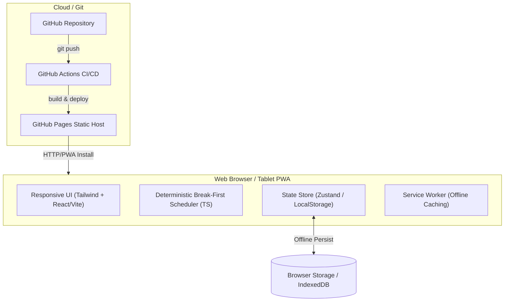

# Key Findings & Next-Gen Approach: Hot Seat Break Scheduler

## 1. Executive Summary

Over the course of developing the Python/PySide6 application, we explored the operational and mathematical realities of **continuous industrial scheduling (hotseating and relief management)**. 

The Python prototype served as an invaluable testing ground:
- We proved out **break-first scheduling** (keeping operators in seats and only rotating to cover breaks) rather than artificial fixed-cadence swaps.
- We validated the **daily allocation workflow** (attendance -> key equipment -> truck auto-fill -> shift review).
- We modeled the operational dependency of **circuits** (excavators driving truck demand).

However, the architecture veered off course into **academic simulation complexity** and **desktop-only isolation**. By using PySide6 (Qt) and building a playback clock engine (play/pause/speed multipliers), the tool became a desktop simulation rather than an agile, mobile tool for shift supervisors and dispatchers in the field.

Moving to a **Web-Based Progressive Web App (PWA)** hosted via GitHub Pages directly solves these core friction points:
1. **Zero-install cross-platform delivery**: Runs instantly on field tablets (iPad/Android) and desktop dispatch PCs via a simple URL.
2. **Push-to-deploy workflow**: Pushing code to GitHub deploys immediately with GitHub Actions.
3. **Offline-first capability**: PWA service workers and local storage allow full operation in remote pits without stable Wi-Fi.
4. **Shift operations tool, not a simulation**: Directly tracks real shift time, live alerts, and rapid one-tap adjustments.

---

## 2. What We Learned from the Python App

### What Worked (Core Assets & Validated Concepts)

1. **"Break-First" Scheduling Was the Big Algorithmic Breakthrough**
   - *Initial Concept (Web V1)*: Rotated operators on fixed operating timers (e.g. swap every 2 hours). This created unnecessary vehicle changeovers, seat adjustments, and handover friction.
   - *Python Prototype Insight*: Real industrial operations minimize cab swaps. Operators stay on their primary machine throughout the shift. Swaps occur **only** when an operator requires a mandatory meal/rest break (crib) and a relief driver takes over, or at shift handover.
   - *Synchronized vs. Staggered Modes*:
     - **Staggered Mode** (when spare/floater operators exist): Relief operators rotate through machines to cover breaks one-by-one, keeping production continuous.
     - **Synchronized Mode** (when zero spares exist): All machines park up simultaneously for crib, ensuring clean, coordinated operational pauses.

2. **The Daily Shift Setup Wizard is Essential**
   - Shift coordinators don't configure schedules abstractly; they execute a specific morning routine:
     1. Mark attendance & leave (who called in sick today?).
     2. Assign high-priority key machines (diggers, ROM loaders, drills).
     3. Auto-fill the haul truck fleet with remaining qualified drivers.
     4. Review spares/relief pool and kick off the shift.
   - The multi-step allocation wizard was universally recognized as the most practical feature.

3. **Circuit-Centric Operations (Excavator <-> Haul Fleet)**
   - Machines cannot be treated in isolation. Haul trucks are tethered to specific excavators. If an excavator shuts down for crib, stopping its haul fleet prevents queue bottlenecks at other diggers.

4. **Visual Timeline (Gantt) with Unified Rulers**
   - A single-track, pixel-aligned Gantt view grouped by zone or equipment category gave immediate visual reassurance of coverage and break legality.

5. **Hard Safety Rules vs. Soft Preferences**
   - **Max Continuous Workstretch** (e.g., maximum 4 hours without a 30-min break) must be an uncompromised hard constraint.
   - Cooldown periods (minimum 90 mins between breaks) and shift-end blackout windows prevent unrealistic break clustering.

---

### Where the Direction Went Wrong (Pain Points & Dead Ends)

| Problem Area | What Happened in the Python App | The Impact & Lesson Learned |
| :--- | :--- | :--- |
| **Desktop Platform Lock-in** | Built with PySide6 (Qt) in Python 3.13. Bound to a Windows `.bat` launch script and local desktop runtime. | **Cannot run on field tablets.** Supervisors, lead hands, and dispatchers need mobility (in-cab tablets, rugged field slates, or laptops). PySide6 is impossible to deploy cleanly to an iPad or Android tablet. |
| **Simulation vs. Operational Reality** | Implemented digital clocks, play/pause buttons, tick intervals, and 1x/2x/4x playback speeds. | Shift coordinators don't want to "play a simulation" at 2x speed. They are managing an **active 12-hour shift happening in the real world right now**. The app should be synchronized to the wall clock, showing "Current Status" and "What's Happening in the Next 30 Minutes". |
| **Theoretical Solver Bloat** | Added OR-Tools CP-SAT stubs, complex Dijkstra zone travel graphs, Circadian low-point math, and multi-tier disruption engines. | Over-engineered academic theory that was never fully utilized (the solver fell back to the heuristic anyway). It bloated the codebase to ~8,000 lines of complex boilerplate that hindered agile UX progress. |
| **Data Silos & Deployment Friction** | State locked into a local `state.json` file. Updating code required git pulls, virtual environments, pip dependencies, and batch files. | Updating a tablet or sharing the schedule with another supervisor across shifts required manual file copying. Zero cloud or URL-based accessibility. |
| **Mouse-Centric UI Design** | Dense Qt desktop widgets, tiny right-click menus, drag-and-drop requiring precise mouse coordinates. | Frustrating on touchscreens. A tablet interface needs large tap targets, tactile action cards, and swipe gestures. |

---

## 3. Comparing the New Approach Angles: Web vs. Android

The user is deciding between **Web-Based** and **Android-Based**, with a strong preference for web so it can be uploaded to Git and run directly on tablets and PCs.

### Detailed Comparison

| Evaluation Metric | Option A: Modern Web App (PWA) ⭐️ **RECOMMENDED** | Option B: Native Android App (Kotlin / Jetpack Compose) |
| :--- | :--- | :--- |
| **"Run straight to tablet or PC"** | **Flawless**: Open a single URL in Chrome/Safari/Edge on any device (iPad, Android tablet, Windows PC, Mac). | **Poor for PC / Mixed Fleet**: Works only on Android tablets. Cannot run natively on Windows dispatch PCs or iPads. |
| **Deployment Workflow** | **Git Push & Done**: Pushing to GitHub triggers GitHub Pages / Vercel. Instant zero-install access across the site. | **Complex Toolchain**: Requires Android Studio, Gradle builds, ADB sideloading or internal APK distribution channels. |
| **Offline Reliability in Pit** | **Excellent (PWA)**: Service Worker caches all JS/CSS/assets. LocalStorage / IndexedDB stores all state. Runs 100% offline. | **Excellent**: Native local SQLite database and local execution. |
| **Touch & Tablet Ergonomics** | **First-Class**: Modern CSS (Tailwind) and responsive component libraries provide fluid touch targets, gestures, and auto-adapting layouts. | **First-Class**: Jetpack Compose gives excellent native touch responsiveness. |
| **Maintenance Burden** | **Single Codebase**: One unified codebase covers all form factors and operating systems. | **Fragmented**: Would still need a separate web or desktop client if someone wants to view it on a dispatch PC. |

### Verdict
A **Web-Based Progressive Web App (PWA)** is decisively the right choice. It satisfies every operational and logistical goal:
- Upload to GitHub and it's immediately live.
- Open on the desktop PC at the dispatch desk.
- Bookmark or "Add to Home Screen" on any Android tablet or iPad in the pit, functioning offline just like a native app.

---

## 4. Blueprint for the Next-Gen Web Application

### Core Design Philosophy: *"Operational Shift Tool, Not a Game Simulation"*

Instead of a desktop simulation engine, the new app will be designed as a **Tactile Shift Management Console**:
- **Real-Time Wall Clock Sync**: Defaults to the actual current time. A prominent header shows current shift progress, which operators are currently on break, and who is up next.
- **Fast Daily Setup**: A streamlined 3-step morning modal that can be completed in under 60 seconds.
- **One-Tap Shift Interventions**:
  - `[ Send to Break Now ]`
  - `[ Relieve Machine ]`
  - `[ Mark Operator Sick / Absent ]`
  - `[ Park Machine (Maintenance / Standby) ]`
- **Visual Schedule with Tap-to-Inspect**: A clean, responsive Gantt timeline that scrolls smoothly on tablets and PCs.

---

### Technical Architecture

### Proposed Stack & Characteristics:
1. **Framework**: React 18+ with Vite and TypeScript.
   - Ultra-fast development, instant hot module reloading, lightweight production bundle (< 200KB).
2. **Styling**: Tailwind CSS.
   - Mobile-first responsive utilities, dark mode by default, guaranteed minimum 44px touch targets for gloved or tablet use.
3. **State & Local Persistence**: Zustand with `persist` middleware.
   - Instant local storage saving, automatic schema migration, and one-click **"Export Backup JSON" / "Import JSON"** for easy configuration transfers.
4. **Offline Support**: `vite-plugin-pwa`.
   - Generates a service worker that caches the entire app. Can be added to tablet home screens for full-screen, native-feeling use without an internet connection.
5. **Deployment**: GitHub Pages via a lightweight GitHub Actions workflow (`.github/workflows/deploy.yml`).
   - Zero hosting cost, zero server maintenance, automated on every `git push`.

---

## 5. Migration & Phasing Strategy

1. **Step 1: Alignment & Strategy Approval** (Current Step)
   - Review this findings document and confirm the web-first PWA direction.
2. **Step 2: Clean Slate Web Scaffold**
   - Set up Vite + React + TypeScript + Tailwind + PWA in the repository.
   - Configure automatic GitHub Pages deployment.
3. **Step 3: Core Domain Port**
   - Port the validated Python data models and break-first algorithm to clean TypeScript.
   - Import existing equipment, operator roster, and pit configurations from `state.json`.
4. **Step 4: Tablet-First UI Construction**
   - Build the 3-step Shift Allocation Wizard.
   - Build the Live Shift Dashboard & interactive Gantt timeline.
   - Implement rapid one-tap operational controls.
